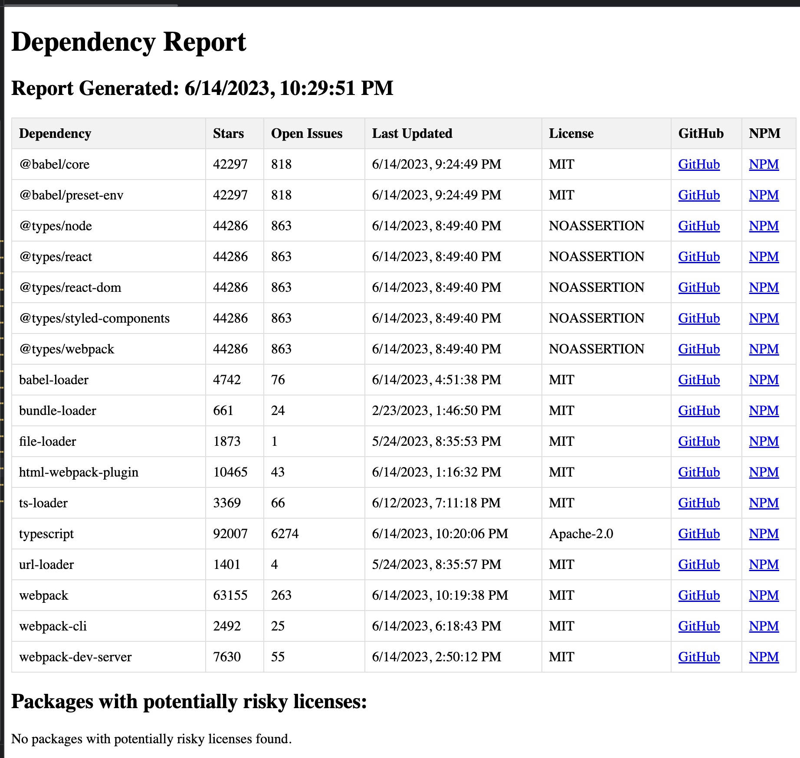

[](https://badge.fury.io/js/package-json-analyzer)

# NPM Dependency Reporter

This project is a tool for analyzing dependencies from a `package.json` file. It generates an HTML report that provides information about each dependency's repository. The report includes the star count, open issue count, last updated date, homepage (on both npm and GitHub), and the license type.

## Installation

You can install this package via npm using the following command:

```shell
npm install package-json-analyzer
```

## Usage

The main function `getDependencyReport` requires three parameters:

- `packageJsonPath`: The path to the `package.json` file to analyze.
- `outputHtmlPath`: The path where the HTML report will be saved.
- `githubToken`: Your GitHub personal access token. This is required to use GitHub's API to fetch repository information.

Here's an example of how you could use this function:

```javascript
import getDependencyReport from 'package-json-analyzer';

const packageJsonPath = './path/to/your/package.json';
const outputHtmlPath = './path/to/output/report.html';
const githubToken = 'your github token here';

getDependencyReport(packageJsonPath, outputHtmlPath, githubToken);
```



This will create an HTML report at the specified `outputHtmlPath`. The report contains information about the dependency's GitHub and npm homepages, and the type of license.

A check is also performed on the type of license. Packages with licenses that may be considered risky for commercial development (like GPL, AGPL, SSPL) are highlighted. If such packages are found, their details will be displayed separately in the report.

## Contributing

Contributions are always welcome. Please make a pull request.

## License

This project is licensed under the terms of the MIT license.
